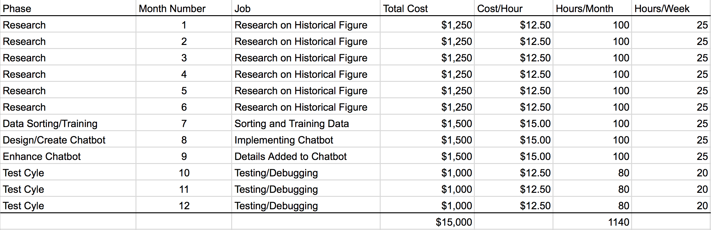

# Project Proposal

## Introduction
Digital history introduces historical content through various forms of media such as internet networks and software systems. This project’s objective is to implement a chatbot of a historical figure to enhance the user’s educational experience. In order to create an intelligent chatbot to imitate historical figures accurately, proper data must be fed to the bot. Information can be scraped from newspapers, journals, and other media. The data will be trained on to be able to replicate the language style. Once enough information is attained, the bot will be able to successfully emulate a historical figure, creating an instant and interactive learning experience for all users. The interaction with the chatbot will change the learning style in classrooms, creating new opportunities for students to absorb information.

Through research, personal details of various historical figures can be retrieved, creating a genuine bot that will precisely be able to mimic the language, information, and speech that the real figure would have known. These historical figures may include past presidents, organization leaders, scholars and authors, and any other significant individuals. Interacting with a replica can create a new opportunity to change the learning style in a classroom. Advanced technology will allow studies to be performed to compare this new learning style with the traditional classroom setting to possibly prove which style of learning is optimal. Chatbot users may improve their critical thinking skills, encouraging students to thoroughly question the subject to help them expand their knowledge. This interactive platform may inspire users to further engage in historical figures, enhancing their overall learning experience. Being able to communicate with a mathematically replicated historical figure could evoke deep thought and push users to question history. These potential questions could be answered by the chatbot in the most statistically correct way, creating and solving both new and old theories. All the possible outcomes from this new system provide important information that will help improve digital history.

Creating a chatbot of a historical figure may lead to the discovery of a new tool to improve digital history. Interaction with a duplicate of a historical figure could enhance the users’ learning experience and increase their interest in the subject. Users will be able to directly ask questions and be engaged in a conversation with the figure they are learning about. The learning style will switch from traditional textbooks to an informative conversation, pushing students to absorb material through interactive means. Additionally, advanced technology could lead to a new form oral history, creating a more responsive environment compared to conventional methods of reading and memorization. The chatbot can be used as an interaction from text to text, text to speech, or speech to speech. The inclusion of speech could perform similarly to oral history, allowing the bot to speak to users while producing images or other forms of visual and textual aid to heighten the experience.

## Methods
The plans for the research consists of four phases. To create an intelligent and accurate historical figure, a vast amount of data must be collected. This is the first phase of the project. Data from journals, diaries, newspapers, and the internet are important. To accomplish this, additional software and tools are required. Taking data from newspapers, diaries, and journals can be challenging, however with the tools of optical character recognition (OCR), texts can be identified through a scanned photo of the documents. This process is much more efficient as the documents do not have to be analyzed individually since the contents are converted to text. The labor of analyzing each document is now eliminated and computers can process thousands of pages within a few moments. Documents such as interviews or any video files will require a speech to text software to convert the speech from the audio to a text file. This process is necessary to eliminate the countless hours of human labor. The data on the internet can be scraped using computer programs which can extract the text online and store the data elsewhere.

For the second phase of the project, the data that was retrieved must be manipulated using machine learning. Before feeding the data to the machine, the data needs to be organized by date. Once organized by date, the correct data must be fed to the machine. The machine learning software will analyze the sentence structure and the vocabulary used. The data collected through the historical figure’s personal emails, journals, and other documents, will help create a closer replicate of the original figure. The more data of their personal writing or audio, the more likely it is for the chatbot to be identical to the historical figure. If there are not enough personal documents, the missing data will have to be replaced by other documents or a decision has to be made by a committee of historians to decide what data is most accurate and appropriate to replace it with.

The third phase will create the proper responses to specific questions and create cases for situations where the question is not relevant to the historical figure. Through the multiple uses of the chatbot, the program will be using machine learning and neural networks to be able to identify patterns and learn from the previous conversations. This will allow the machine to increase its performance and respond with better answers each time.

The final stage of the project will be testing and debugging. Once the data is trained and the chatbot’s sentence structure and vocabulary have been processed, the chatbot will require testing. The prototype needs to be evaluated to meet basic requirements such as being able to respond to the user with the correct information and to be able to respond correctly when the question is not relevant. A committee of historians must interact with the chatbot to analyze the accuracy of the sentence structure, vocabulary, and speech.

With the research, the chatbot will be able to mimic a historical figure accurately. However, since this is based on the amount of data that can be collected on the figure, the chatbot will require an enormous amount of different documents to be able to train the machine to mimic the figure’s speech.

## Timeline
### First 6 months
Majority of the time will be spent on research. This is the most crucial part of the entire project. The accuracy of the chatbot is dependant on the data that is collected through research that must be conducted in all forms of media. It is important to go through the newspaper of the timeline to limit the knowledge of the chatbot, keeping the machine within its era. The news will help feed data on world events that occurred at that time and other possible information required to establish the historical figure. Details of world news will be important because some data may be required to substitute any missing information from personal records.

Within the six months, the majority of research will be spent on finding personal documents or any documents that are related to the historical figure. This part of the project will determine the accuracy of the chatbot itself. Any documents that contain information of the historical figure’s routines, beliefs, speeches, and values are crucial to the project.

### The next 3 months
The seventh month will be spent organizing and training the data collected. It will require a significant amount of time to process thousands of texts and be able to analyze the data to allow for readjustments. The following month will consist of processing the data and programming the chatbot. The main goal at this time will be to design and create the chatbot to be reliable and responsive. The program will require specific cases to handle when the questions are irrelevant. The third month will be to integrate the analyzed data to the chatbot. This time will be used to tailor the language style and highlight vocabularies that are frequently used by the historical figure.

### The final 3 months
The last three months will be needed to test and debug the program. It is important to go through test runs of products before launch. The first step in a test cycle will be the release of a prototype to several historians. The historians will respond back with feedback for historical accuracy and their experience with the program. Once the feedback is received, the changes and fixes will be made. Each cycle will take approximately two weeks. One week to allow users to experiment with the program and the second week to fix and debug the problems. The second cycle of the test will be sent to a larger group of people, specifically academics. This group will give feedback on how the program would perform in their classrooms or possible requests for the program to suit their teaching styles. Once again, after the feedback has been received, the program will be fixed and debugged. This testing cycle will continue until a significant amount of different people have tested the program. The program will be tested on students, teachers, specialists of the topic, and the general population. Each cycle will progressively grow to allow the program to develop with the core objective which is to create an accurate historical figure.

## Importance
This research will be creating a new tool in digital history, advancing the overall learning outcome for all students. It can vary from an expansion of oral history or could be categorized as a whole new tool. Designing a chatbot with audio support will further enhance the oral history experience while providing an interactive and unique experience. The chatbot can support visuals and text to further educate the users as it narrates its own history. Students will be able to see visuals or additional text information to support their learning and help bring the history to life. The chatbot as its own tool is beneficial in many ways. The tool will help inspire the youth, support their learning and expand their knowledge, and challenge the idea of history.

History is told from the first person along with the ability to interact will create a new experience for students. The chance for students to directly interact with the historical figure will be a new and captivating style of learning. Students will be engaged in a conversational style which can create a memorable experience. They will be able to have a conversation with a figure they admire, challenging the boundaries of their knowledge while pursuing their endless curiosity. Having a lesson in an interactive style will increase the critical thinking aspects of students. Students will be engaged in a one on one conversation, allowing those who are normally too shy to interact in an open classroom to participate through a direct and personal system. This system places students in a position to question the historical figure and challenge the history in a safe environment. Creating the opportunity to further their thinking will allow them to develop their learning and have a deeper understanding of the material.

This tool will encourage student’s fascination in historical context, allowing future generations to bring history to life, strengthening their desire to learn through a new perspective. Incorporating innovative technology gives students the opportunity to imagine new tools and to take initiative to contribute to history. Higher levels of technological involvement will open up potential job opportunities for students in other fields such as STEM to use their talent in the field of history. Integrating engineers to history can increase the development of tools allowing for further research to advance current tools while possibly creating new methods of digital history. Combining the latest technology with history will enhance the overall learning experience, pushing users to engage and expand their knowledge in a new and interesting way.  

## Budget

All the position to carry through with this new system will be part-time positions. The research position will be $12.50/hr and will be open to students. The cost for the programming position will be $15.00/hr while the cost will increase to invite high skilled coders. The testing/debugging position will be $12.50/hr as it requires less work and work is based on feedback.
